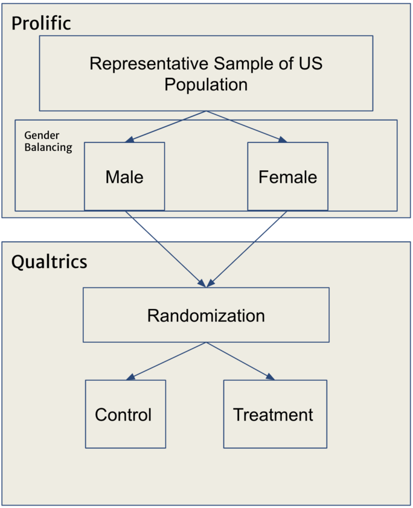
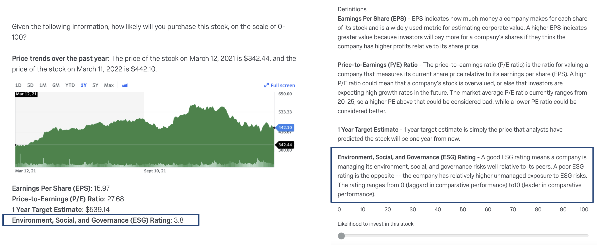
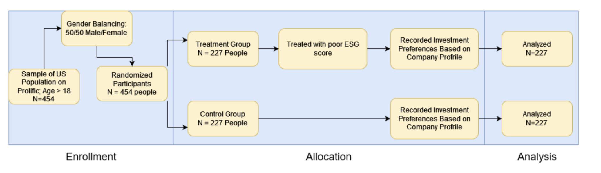

```{r global options, include = FALSE}
knitr::opts_chunk$set(include = FALSE, message = FALSE, warning = FALSE)

knitr::knit_engines$set(problem_description = function(options) {
  code <- paste(options$code, collapse = "\n")
})
```

```{r setup, include=FALSE}
knitr::opts_chunk$set(echo = FALSE)
library(stargazer)
```

```{r}
library(data.table)
library(sandwich)
library(lmtest)

library(ggplot2)
library(knitr)
library(foreign)
library(stargazer)
```
# Introduction

Does negative ESG information influence retail investors’ propensity to invest in a stock? Warren Buffett, chairman and CEO of Berkshire Hathaway and widely regarded as one of the world’s most successful investors with a net worth of over $125 billion, said “all there is to investing is picking good stocks at good times and staying with them as long as they remain good companies.” Within the backdrop of climate change, social justice movements, and increased awareness by the general population on corporation’s impact on the world that we live in, the notion of what defines a “good” company has changed. Environmental, Social, and Governance (“ESG”) focused investing began in the 1960s but has exponentially grown in recent years as heightened attention has been put on these topics secularly. 
One way that this heightened emphasis on ESG investing has been exemplified is through Larry Fink, the CEO of Blackrock which manages $10 trillion of assets, and his yearly letters in which he conveys his ideas about capitalism, climate change, and innovation. In Larry Fink’s 2019 CEO letter, he wrote that “to prosper over time, every company must not only deliver financial performance, but also show how it makes a positive contribution to society.” This was made as a call to action to CEOs to ensure that their companies were increasing their “ESG” values - doing good for the environment, society, and governance of their own companies. 

## Background

Large institutional investors (e.g., Blackrock) have shown heightened sensitivity to ESG issues in companies in the public and private markets. In Preqin’s 2020 Impact Report, which studied ESG within the private markets, Preqin found that ESG-committed fund managers perform on par with their non-ESG counterparts, all while mitigating potential material ESG risks. 
Calls for action in ESG consciousness of companies and the shift of institutions into putting higher weight in ESG investing have been evident, but the question remains on the impact of this information on retail investors’ propensity to invest in certain securities. 

This study will evaluate whether ESG information will have an impact on retail investor’s propensity to invest in a company. Ultimately, there were several ways that this experiment could be conducted: providing positive ESG information to treatment individuals, providing negative ESG information to treatment individuals, and conducting a multifactor experiment showing a range of ESG information to each individual across various companies. Considering the limitations of this study in terms of budget and time allotted to complete the study, the research group decided on evaluating the effect of negative ESG information about a company on a retail investor’s propensity to invest in the company. 

The treatment of negative ESG information was chosen due to our belief that retail investors follow the psychology laid out in prospect theory. Prospect theory is a behavioral economic theory that says that “investors value gains and losses differently, placing more weight on perceived gains versus perceived losses… an investor presented with a choice, both equal, will choose the one presented in terms of potential gains” (https://www.investopedia.com/terms/p/prospecttheory.asp). This theory can be interpreted in that retail investors are thought to dictate their investment decisions from a thought process of risk aversion - in the presence of negative information, there is thought to be a lower propensity to invest. Under the context of this theory, this study investigates whether investors will be induced to lower their propensity to invest in a company due to the risk aversion against being presented with negative ESG information. 

The control group individuals in this study were given financial data about an anonymized company including price trends over the past year, earnings per share, price to earnings ratio, and 1 year target estimates as well as definitions for each of these variables. The treatment group individuals received the same above information about the same anonymized company but also received an ESG rating with a definition for the ESG rating included as well. 

## Hypothesis

The null hypothesis in our experiment is that lower ESG scores have no effect on retail investor propensity to invest in a specific stock. The alternative hypothesis in our experiment is that lower ESG scores have an effect on retail investor propensity to invest in a specific stock.


```{r, include=FALSE}
d <- read.csv(file = 'data/input/ESG Survey 3_April 8, 2022_10.20.csv')
d <- data.table(d)
colnames(d)
```

# Experiment Details

## Potential Outcomes
The potential outcomes to be compared are the “Likelihood to Invest” in the presented company from the control and treatment groups.


```{r test_table, include=TRUE}
Assignment <- c("Treatment", "Control")
R <- c("Random Assignment to Treatment Group", "Random Assignment to Control Group")
o <- c("Measurement of Covariates", "Measurement of Covariates")
X <- c("Administration of Treatment", "")
O <- c("Measurement of Outcome Variable", "Measurement of Outcome Variable")

df <- data.frame(Assignment, R, o, X, O)

kable(df, col.names = c("Assignment", "R", "O", "X", "O"), align = "ccccc", caption="ROXO Diagarm")
```

```{r}
columns_to_analyse <- c('StartDate', 'EndDate', 'Duration..in.seconds.', 'Q18', 'Gender', 'Investing.knowledge','Age', 'Education', 'Household.income', 'Ethnicity', 'Stock_1', 'Q22', 'Gender.1', 'Investing.knowledge.1', 'Age.1', 'Education.1', 'Household.income.1', 'Ethnicity.1', 'Stock_1.1')
columns_temp <- c("StartDate", "EndDate", "Q18")

# subset only columns we want to analyze
subset(d, select = columns_to_analyse)
nrows <- nrow(d)

# remove the metadata
d <- d[3:nrows,]
d <- d[d$StartDate >= "2022-04-06 14:33:20"]
```

```{r}
hist(as.numeric(d$Duration..in.seconds))
```


```{r}
# add the assignment to treatment
d$assignment_to_treatment <-  ifelse(d$Gender.1 == "", 0, 1)
d$assignment_to_treatment_name <- ifelse(d$assignment_to_treatment == 1, "Treatment", "Control")

# aggregate treatment and control variables into one variable
d$gender <- ifelse(d$assignment_to_treatment == 1, 
                              d$Gender.1, d$Gender)
d$investing_experience <- ifelse(d$assignment_to_treatment == 1, 
                                           d$Investing.knowledge.1, d$Investing.knowledge)
d$age <- ifelse(d$assignment_to_treatment == 1, 
                           d$Age.1, d$Age)
d$education <- ifelse(d$assignment_to_treatment == 1, 
                           d$Education.1, d$Education)
d$household_income <- ifelse(d$assignment_to_treatment == 1, 
                           d$Household.income.1, d$Household.income)
d$ethnicity <- ifelse(d$assignment_to_treatment == 1, 
                           d$Ethnicity.1, d$Ethnicity)
d$stock <- ifelse(d$assignment_to_treatment == 1, 
                           d$Stock_1.1, d$Stock_1)

# fill "No Data" for rows that do not have data
d[d$gender == ""]$gender <- "No Data"
d[d$investing_experience == ""]$investing_experience <- "No Data"
d[d$age == ""]$age <- "No Data"
d[d$education == ""]$education <- "No Data"
d[d$household_income == ""]$household_income <- "No Data"
d[d$ethnicity == ""]$ethnicity <- "No Data"
d[d$stock == ""]$stock <- "No Data"
```

```{r}
attach(d)
plot(as.numeric(d$Duration..in.seconds), stock, main="Scatterplot Example",
   xlab="time", ylab="conf", pch=19) 
```

## Randomization

Random assignment into the treatment and control groups was handled automatically through our survey hosting platform, Qualtrics. We opted for a gender balanced sample, through our participant access platform, Prolific, as shown in Figure 1. Upon receiving the results, we were somewhat concerned that randomization was conducted improperly, as we had more Male participants than Female in the Control Group, as shown in Figure 2a. However, we also plotted other covariates and found that other covariates were quite balanced visually. The full list of columns are in Table 2. We conducted covariate balance checks and found that the differences in covariates are not statistically significant. Hence we do not have any reason to believe that the randomization was not conducted properly.

```{r covariates, include=TRUE}
covariates_in_experiment <- c("Gender", "Age", "Ethnicity", "Education Level", "Household Income", "Investing Experience")
possible_values <- c("Female, Male, Non-Binary", 
                     "<20, 20-59, 60+",
                     "Asian, Black, Hispanic, Native American, White, Other",
                     "Associate, High School, Undergraduate, Postgraduate",
                     "<$25k, $25-$50k, $50-$100k, $100-$150k, $150k+",
                     "0-1 year, 1-5 years, 5-10 years, 10+ years")

df <- data.frame(covariates_in_experiment, possible_values)

kable(df, col.names = c("Covariates in Experiment", "Possible Values"), align = "cc", caption="The covariates in our experiment and their possible values")
```



### Covariate balance check

We conducted a covariate balance check to ensure that our experiment randomized appropriately. The covariate features we used for the analysis are gender, age, education, household income, ethnicity, and investing knowledge. These were optional questions for the respondents to answer, but they answered all of them except one person did not answer one question about age.


```{r, include=TRUE, fig.width=3.6, fig.height=3}
# Gender
ggplot(d, aes(x = assignment_to_treatment_name, fill = gender)) +
  geom_bar() +
  ylab("Number of Participants") +
  xlab("Assignment") +
  ggtitle("Gender") +
  labs(fill = "Gender")

# Investing Experience
ggplot(d, aes(x = assignment_to_treatment_name, fill = factor(investing_experience, levels=c("0-1 year", "1-5 years", "5-10 years", "10+ years")))) +
  geom_bar() +
  ylab("Number of Participants") +
  xlab("Assignment") +
  ggtitle("Investing Experience") +
  labs(fill = "Investing Experience")

# Age
ggplot(d, aes(x = assignment_to_treatment_name, fill = age)) +
  geom_bar() +
  ylab("Number of Participants") +
  xlab("Assignment") +
  ggtitle("Age") +
  labs(fill = "Age")
  
# Education
ggplot(d, aes(x = assignment_to_treatment_name, fill = factor(education, levels=c("Associate", "High School", "Undergraduate", "Postgraduate")))) +
  geom_bar() +
  ylab("Number of Participants") +
  xlab("Assignment") +
  ggtitle("Education Level") +
  labs(fill = "Education Level")

# Household Income
ggplot(d, aes(x = assignment_to_treatment_name, 
              fill = factor(household_income, levels=c("<$25k", "$25-$50k", "$50-$100k", "$100-$150k", "$150k+")))) +
  geom_bar() +
  ylab("Number of Participants") +
  xlab("Assignment") +
  ggtitle("Household Income") +
  labs(fill = "Household Income")

# Ethnicity
ggplot(d, aes(x = assignment_to_treatment_name, fill = factor(ethnicity, levels=c("Asian", "Black", "Hispanic", "Native American", "White", "Other")))) +
  geom_bar() +
  ylab("Number of Participants") +
  xlab("Assignment") +
  ggtitle("Ethnicity") +
  labs(fill = "Ethnicity")
```

We conducted an F-test to test whether adding covariates improved the ability to predict whether someone was in the treatment group or not. If adding covariates improved the ability to predict whether someone was in the treatment group, it would indicate that covariates were not balanced across treatment groups. For the F-test, the first model regresses the treatment indicator variable with just an intercept. The first model has no predictive features. The second model predicts the treatment indicator with all the covariates. The null hypothesis is that each of the covariate differences between the control and treatment are 0.

When we conduct the F-test, we find that the p-value of the test is 0.12, and hence we do not reject the null hypothesis. Hence we do not have evidence to show that covariates are unbalanced between the two groups, and that our data passes the covariate balance check.

## Treatment

Treatment in the experiment was the addition of a numeric ESG score to the company metrics presented to the participants, as well as the accompanying explanatory text of that ESG metric, as shown in Figure 3. The ESG rating is on a scale of 0 to 10, with 10 indicating a company is managing its ESG risk well relative to its peers and 0 indicating a company is not managing its ESG risk relative to its peers. We presented the same ESG score and explanatory text to all participants in the treatment group.

Although it appears we had perfect compliance, we are skeptical of some of the results. Some participants viewed the presented material for less time than we felt was reasonable. This may indicate noncompliance with assignment, although we cannot know with certainty. To remedy this potential noncompliance, alternative administration may be necessary. We could show each metric separately, then ask for the likelihood to invest. This would eliminate situations in which the participant only reads a single part of the company information. We could also test participants’ knowledge of the presented definitions, to see if they actually read and understood the information presented.



## Consort Document



## Power Calculation

We first calculated the sample size needed to achieve the power of 0.8. To do so, we arranged the formula in the Field Experiments textbook and used estimates from a pilot study as inputs. In the pilot study, there were 50 respondents. In the pilot study, the control mean was 53.714, the treatment mean was 46.571, and the standard deviation was 25.91. We also imputed the desired power of 0.8 and significance level of 0.05. We are assuming that the distribution of treatments and control variables will be normal. Using this information, the sample size needed is 413.1. Hence we will need at least 414 respondents under these assumptions. 

$$N = \Bigg(\frac{\Big(\Phi^{-1}(\beta) + \Phi^{-1}(1-\frac{\alpha}{2})\Big) 2\sigma}{|\mu_t-\mu_c|}\Bigg) ^ 2$$

We then calculated the power the experiment anticipates to generate. We once again used the control mean, treatment mean, and sigma from the pilot study. We expect the significance level of 0.05. From the class, we had a budget of $500 USD, and on Prolific, assuming that each person takes 5 minutes for our survey, we could have 454 participants within our budget. Using the formula in the Field Experiments textbook, the power we expect to generate in our experiment is 0.836.

$$\beta = \Phi\Big(\frac{|\mu_t-\mu_c|\sqrt{N}}{2\sigma} - \Phi^{-1}(1-\frac{\alpha}{2})\Big)$$

```{r}
# To check quantitatively, use F-test 

null_mod <- d[ , lm(assignment_to_treatment ~ 1)]
# gender, investing experience, age, education, ethnicity
full_mod <- d[ , lm(assignment_to_treatment ~ 1 + I(gender) + I(investing_experience) + I(age) + I(education) + I(ethnicity))]
anova_mod <- anova(full_mod, null_mod, test = 'F')
anova_mod
```
The p-value is greater than 0.05, and we do not reject the null hypothesis that each of the differences between treatment and control are 0.

```{r}
d[(d$age == "No Data") | (d$education == "No Data") | (d$household_income == "No Data") | (d$ethnicity == "No Data") | (d$stock == "No Data") | (d$investing_experience == "No Data")]
```

```{r}

ggplot(d, aes(x=as.numeric(stock), fill=as.factor(assignment_to_treatment))) +
  geom_density( color="#e9ecef", alpha=0.2, position = 'identity') +
  scale_fill_manual(values=c("green", "red")) +
  labs(fill="Assignment to Treatment") +
  xlab("Likelihood to Invest in Presented Company") + 
  ylab("Number of Participants") +
  ggtitle("Comparison of Distributions of Outcome")
```


```{r}
control <- as.numeric(d[d$assignment_to_treatment == 0]$stock)
treatment <- as.numeric(d[d$assignment_to_treatment == 1]$stock)

treatment_mean <- mean(treatment)
control_mean <- mean(na.omit(control))

ate <- (treatment_mean - control_mean) / control_mean


t.test(control, treatment)
```

```{r}
d$duration <- as.numeric(d$Duration..in.seconds)

length(d[d$duration <= 60])

d[(d$duration <= 60) & (d$investing_experience == "0-1 year")]$assignment_to_treatment

length(d[(d$duration <= 60) & (d$investing_experience == "0-1 year")]$assignment_to_treatment)

sum(d[(d$duration <= 60) & (d$investing_experience == "0-1 year")]$assignment_to_treatment)

sum(d[d$duration <= 60]$assignment_to_treatment)

d[d$duration <= 30]$assignment_to_treatment

d
```


```{r}
model <- lm(as.numeric(
  stock) ~ assignment_to_treatment,
            data=d)
coef_se <- lmtest::coefci(model, vcov.=vcovHC(model, type="HC"))
model_summary <- summary(model, se=coef_se)
```


```{r}
covariate_labels <- c("Negative ESG Information",
                      "Gender, Male",
                      "Gender, Non-binary",
                      "Age, 20-59",
                      "Age, 60+",
                      "Age, No Data",
                      "Ethnicity, Black",
                      "Ethnicity, Hispanic",
                      "Ethnicity, Native American",
                      "Ethnicity, White",
                      "Ethnicity, Other",
                      "Education, High School",
                      "Education, Undergraduate",
                      "Education, Postgraduate",
                      "Household Income, $25-$50k",
                      "Household Income, $50-$100k",
                      "Household Income, $100-$150k", 
                      "Household Income, 150k+",
                      "Investing Experience, 1-5 years",
                      "Investing Experience, 5-10 years",
                      "Investing Experience, 10+ years"
                      )
```


```{r}
model_3 <- lm(as.numeric(
  stock) ~ assignment_to_treatment + 
    factor(gender) +
    factor(age) +
    factor(ethnicity, levels=c("Asian", "Black", "Hispanic", "Native American", "White", "Other")) +
    factor(education, levels=c("Associate", "High School", "Undergraduate", "Postgraduate")) + 
    factor(household_income, levels=c("<$25k", "$25-$50k", "$50-$100k", "$100-$150k", "$150k+")) +
    factor(investing_experience, levels=c("0-1 year", "1-5 years", "5-10 years", "10+ years")), data=d)

coef_se <- lmtest::coefci(model_3, vcov.=vcovHC(model_3, type="HC"))
model_summary_3 <- summary(model_3, se=coef_se)
```


```{r}
library(sandwich)
library(lmtest)

model_2 <- lm(as.numeric(
  stock) ~ assignment_to_treatment + 
    I(household_income) +
    I(gender) +
    I(age) +
    I(ethnicity) +
    I(investing_experience) + 
    I(education),
            data=d)
coef_se <- lmtest::coefci(model_2, vcov.=vcovHC(model_2, type="HC"))
model_summary_2 <- summary(model_2, se=coef_se)
```


```{r}
get_power <- function(mean1, mean2, N, sigma, alpha) {
  part1 <- (abs(mean1-mean2) * sqrt(N))/(2*sigma)
  part2 <- qnorm(1 - alpha/2)
  beta <- pnorm(part1 - part2)
  return(beta)
}
```

```{r}
get_power(60,65,500,20,0.05)

get_power(60,65,500,20,0.05)

get_power(mean1=60, mean2=65, N=500, sigma=20, alpha=0.05)

get_power(mean1=53.7, mean2=46.6, N=414, sigma=25.9, alpha=0.05)
```

```{r}
get_sample_size <- function(mean1, mean2, beta, sigma, alpha) {
  part1 <- qnorm(beta)
  part2 <- qnorm(1 - alpha/2)
  ((part1 + part2) * (2*sigma) / abs(mean1-mean2)) ^ 2
}
```

```{r}
get_sample_size <- function(mean1, mean2, beta, sigma, alpha) {
  part1 <- qnorm(beta)
  part2 <- qnorm(1 - alpha/2)
  ((part1 + part2) * (2*sigma) / abs(mean1-mean2)) ^ 2
}
```

```{r}
pnorm(0.4) # normsdist

qnorm(0.95) # normsinv


pnorm(qnorm(0.95))

# Pilot data information
mean1 <-53.714285714285715
mean2 <- 46.57142857142857
beta <- 0.8
sigma <- 25.909692574636413
alpha <- 0.05

get_sample_size(mean1=mean1, mean2=mean2, beta=beta, sigma=sigma, alpha=alpha)
get_power(mean1=mean1, mean2=mean2, N=454, sigma=sigma, alpha=alpha)
```

```{r}
t.test(control, treatment)
```

# Analysis

## Data

The data for the models is exported from Qualtrics. Each participant’s response is logged to Qualtrics, and includes features like survey start time, survey end time, duration in seconds, assignment to treatment, gender, investing experience, age, education, household income, ethnicity, and likelihood to invest in stock.

## Models

Model 1 with just the assignment to treatment as the predictor has the coefficient of 50.633 and -3.124 for the assignment to treatment. This indicates that the estimate of control outcome was 50.633 and the estimate of the treatment average is 50.633 + (-3.124) = 47.509.

Model 2 includes the assignment to treatment as a predictor, in addition to the covariates of gender, age, education, household income, ethnicity, and investing knowledge. In this model, the coefficient for the assignment to treatment is -3.415. The baseline is a respondent who is female, <20 years old, Asian, has an Associate level of education, has a household income of <$25k, and has 0-1 years of investing experience. Adding the covariates decreased the average treatment effect from -3.124 to -3.415. It also increased the R^2 from 0.004 to 0.057, and hence adding the covariates helped explain the variance in the dependent variable. However, average treatment effects in both models are not statistically significant.

Some covariates have a p-value of less than 0.05, but because there are 20 covariates, we need to apply the Bonferroni correction. When we apply that, the covariates will need to have a p-value of less than 0.05/20=0.0025 to be statistically significant. None of the covariates have a p-value of less than 0.0025, so we do not state that any of the covariates have a statistically significant impact on the likelihood to invest in a stock.

## Average Treatment Effect Estimate

In model 1, the average treatment effect is -3.124 and in model 2, the average treatment effect is -3.415.

## Spillover, attrition, and non-compliance

We do not believe there are issues of spillover, attrition, and non-compliance in our experiment. Each participant was directed to the Qualtrics link, which randomly assigns the visitor to one of two survey versions (control and treatment). The participants were also spread geographically across the United States, and the survey was only 5 minutes in length, and hence we don’t believe the participants had communicated to each other about the experiment.

We did not have any people that did not complete the survey. Even for our optional questions of demographics, all were answered except that one person out of 454 respondents did not answer the question about age.

We also do not believe there is strong evidence of non-compliance. There were 38 respondents (8%) who completed the survey in less than 60 seconds and have 0-1 year of experience in stock. We believe that these people could be considered to be non-compliers, as they may have just completed the survey without reading all the information about the stock. However, this group is relatively small, and is split evenly between treatment and control. Hence we believe it is acceptable to leave this group in the experiment analysis.


```{r model_summary_1, message=FALSE, include=TRUE, results = "asis"}

stargazer(model, model_3, title="Impact of Negative ESG Information on the Likelihood to Invest in Stock",
dep.var.labels=c("Likelihood to Invest in Stock"),
covariate.labels=covariate_labels,
omit.stat=c("LL","ser","f"), single.row=TRUE, header=FALSE)
```

